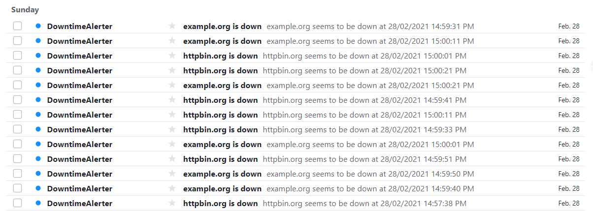

# downtime alerter service

## [Architecture](ARCHITECTURE.md)

## Running and Using

user/passwords:

```
username: serefguneysu at gmail dot com
password: WX&U7gj5B
```

```
username: g.seref at yahoo dot ca
password: FqH4h8J!G
```


## Sending Emails

Sending email is blocked by default to avoid SendGrid free service limits.
To be able to send notification and account related emails, simple change `BlockEmail` feature toggle to `false`.

SengGrid, needs an API key, it can be by:

```
dotnet user-secrets set SendGridKey <key>
```

or using Visual Studit `Manage User Secrets` and adding this line:

```
"SendGridKey": "<REDACTED>"
```



The sqlite database is included in repo and two monitor is defined:

|Id|Name|Url|Interval|
|--|----|---|--------|
|5|example.org|http://example.org/|3mins|
|8|httpbin.org|http://httpbin.org/status/500|1 m|

httpbin.org, configured for returning `HTTP 500` error response code.


## Migrations

```
dotnet tool install --global dotnet-ef
dotnet ef migrations add InitialCreate --context DowntimeAlerterDataContext
dotnet ef database update --context DowntimeAlerterDataContext
```

