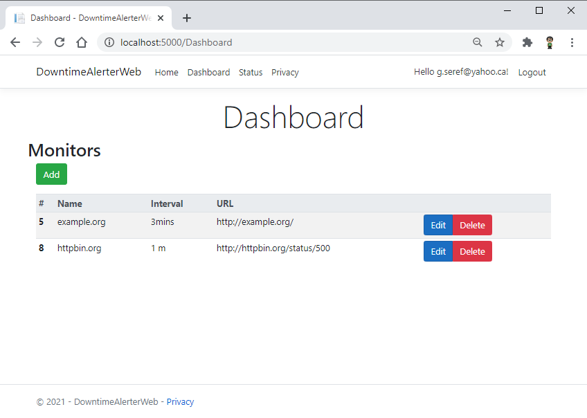
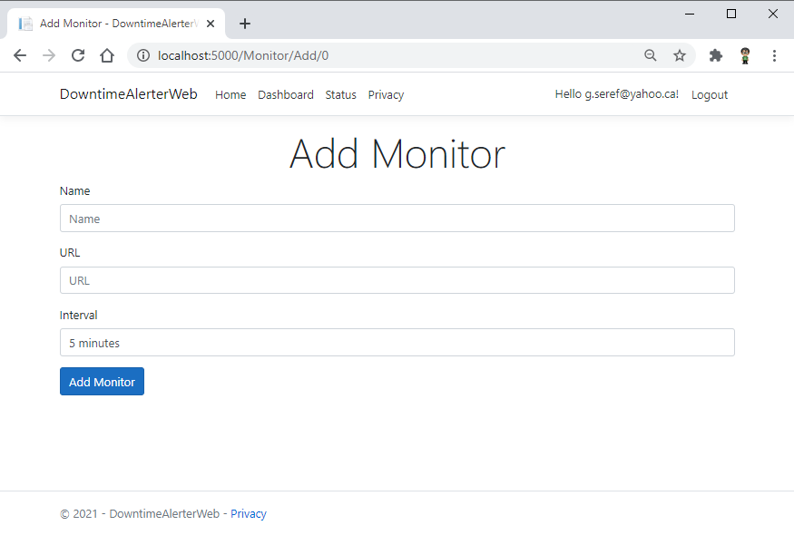
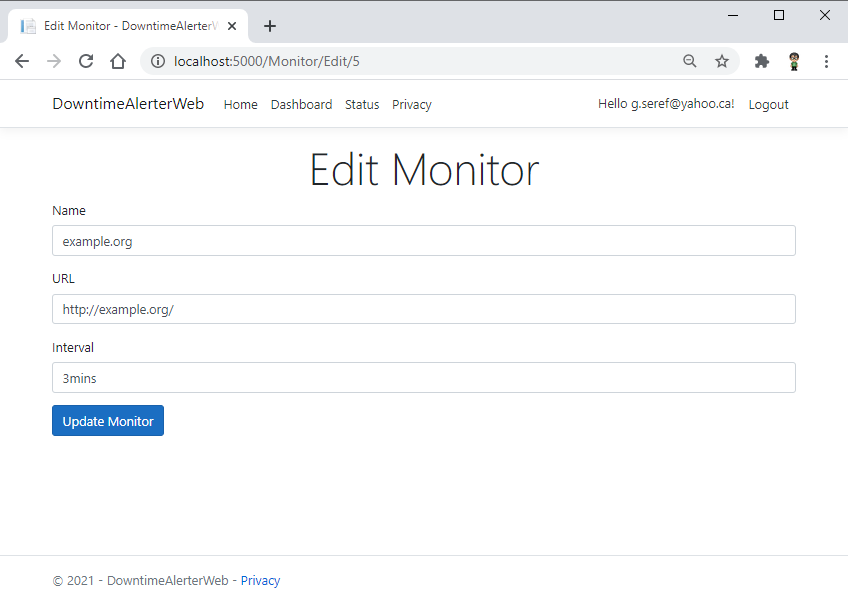
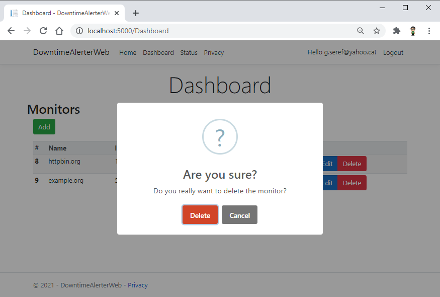
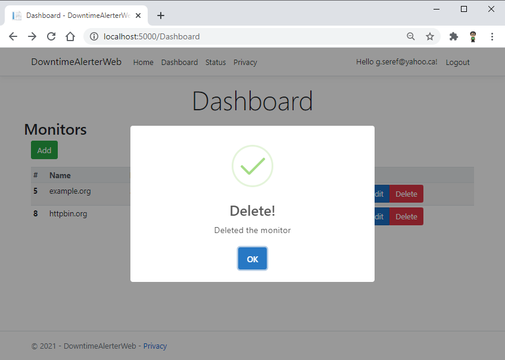
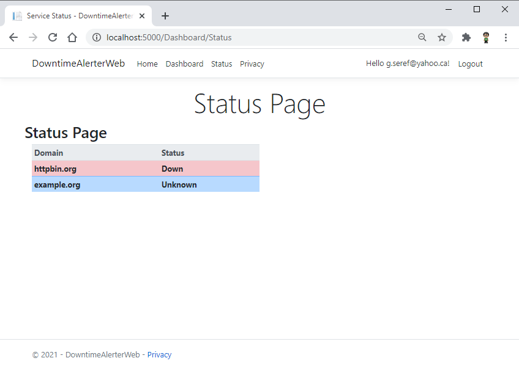
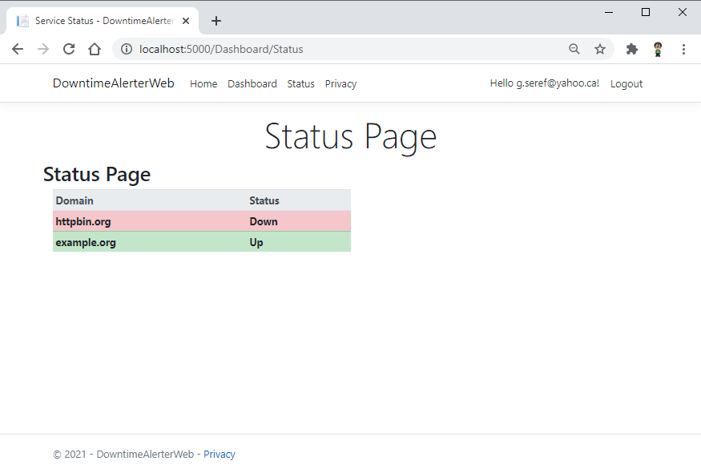
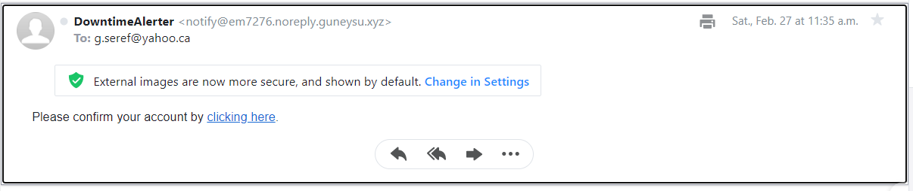

# downtime alerter service

## [Architecture](ARCHITECTURE.md)

## Running

```
dotnet user-secrets set SendGridKey <key>
```

or `Manage User Secrets`

The sqlite database is included in repo and two monitor is defined:

|Id|Name|Url|Interval|
|--|----|---|--------|
|5|example.org|http://example.org/|3mins|
|8|httpbin.org|http://httpbin.org/status/500|1 m|

httpbin.org, configured for returning `HTTP 500` error response code.

## Using

user/passwords:

```
username: serefguneysu@gmail.com
password: WX&U7gj5B
```

```
username: g.seref@yahoo.ca
password: FqH4h8J!G
```


## Migrations

```
dotnet tool install --global dotnet-ef
dotnet ef migrations add InitialCreate --context DowntimeAlerterDataContext
dotnet ef database update --context DowntimeAlerterDataContext
```


## Screenshots















